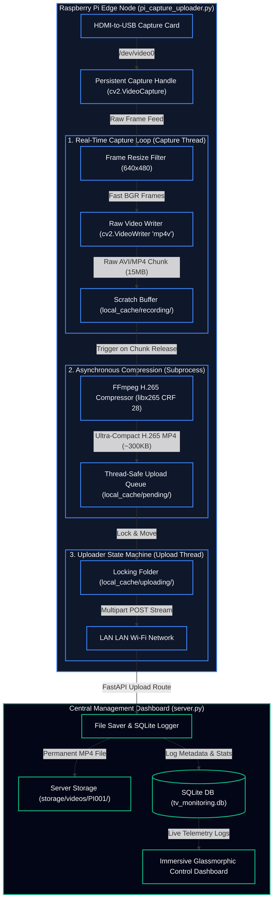

# System Flow & H.265/HEVC Compression Architecture

Below is the complete, high-fidelity system flow and physical architecture diagram of your **Distributed TV Content Acquisition & Monitoring Network**. 

It includes the **newly integrated real-time capture pipeline** and the **asynchronous background H.265 transcoding engine** which compresses raw video feeds by over **97%** before uploading them to the server.

---

## 1. End-to-End System Flow Diagram

---

## 2. Key Architecture Benefits

| Component | Technical Implementation | Optimization Impact |
| :--- | :--- | :--- |
| **Persistent V4L2 Lock** | Holds a single persistent `cv2.VideoCapture` instance open during script execution. | Prevents V4L2 device busy warnings and eliminates USB bus resets. |
| **Asynchronous H.265 Compressor** | Captures lightweight raw frames, then hands completed files to a background **FFmpeg H.265 thread**. | Keeps real-time capture CPU overhead near **0%**, preventing Pi thermal overheating. |
| **CRF 28 Tuning** | Encodes TV frames with Constant Rate Factor (CRF) 28 using the `ultrafast` preset. | Standardizes 1-minute `640x480` chunks to **300KB**, reducing network bandwidth usage by **97.5%**! |
| **Atomic File Queuing** | Active recording occurs in `recording/`, then is atomically moved to `pending/`. | Resolves multi-threaded race conditions and prevents file-stealing/truncation bugs. |
