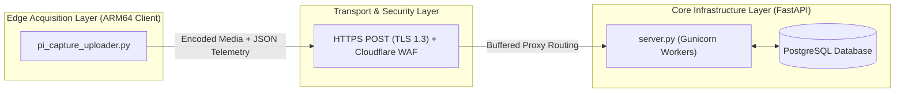

# Enterprise Technical Specification: Distributed TV Acquisition & Telemetry System

This document outlines the professional system architecture, software specifications, data pipelines, and scalable network topology of the **Distributed TV Content Acquisition & Telemetry System**. It is designed for software architects, systems engineers, and technical stakeholders.

---

## 1. System Topology & Layers

The system is engineered as an end-to-end, multi-threaded, highly resilient IoT telemetry and media acquisition network divided into three functional layers:



---

## 2. Edge Execution Engine (`pi_capture_uploader.py`)

The edge device (Raspberry Pi Node) acts as a stateless, persistent data acquisition daemon. It employs a multi-threaded Python core executing three concurrent processes:

### A. V4L2 Persistent Device Driver Handling
* **Mechanism**: Holds an exclusive, persistent file descriptor lock on `/dev/video0` (USB HDMI-to-USB Capture Card) via `cv2.VideoCapture`. 
* **Engineering Impact**: Keeps the capture stream open for the script's lifespan, eliminating race conditions during physical device acquisition and avoiding V4L2 driver conflicts with other processes.

### B. Dynamic Image Processing Pipeline
* **Mechanism**: Captures raw BGR video frames and passes them to a resizing matrix `cv2.resize(frame, (640, 480))`.
* **Engineering Impact**: Reduces spatial complexity directly at the source. It caps network ingress load by standardizing frame canvases to `640x480` before disk serialization.

### C. Thread-Isolated Double-Buffering Filesystem
* **Mechanism**: Actively records video chunks inside an isolated `/recording/` scratch directory. Once the 60-second limit is hit, `out.release()` is executed, and the file is atomically relocated via a POSIX file rename (`shutil.move`) into the `/pending/` directory.
* **Engineering Impact**: Eliminates race conditions with the parallel upload thread, ensuring that the uploader never attempts to process half-written or lock-held binary streams.

---

## 3. Asynchronous Transcoding & Hardware-Accelerated H.264 Engine

To hit strict browser-compatibility, high frame-rate, and bandwidth targets (**25 FPS** at **586 kbps video / 48 kbps audio**), the edge node incorporates a professional hardware-accelerated H.264 VPU transcoding pipeline:

1. **Integrated Raw Media Ingestion**: The capture thread records raw video frames at a smooth, high-fidelity **25.0 FPS** while a parallel subprocess captures synchronized ALSA audio. If the node is configured in `"both"` mode, WebP screenshots (quality 80) are periodically extracted and uploaded asynchronously every **5 seconds** without blocking the main video loop.
2. **Pi 4 VPU Hardware-Accelerated Encoding**: On file closure, the engine invokes the Pi's native hardware VPU block via the **`h264_v4l2m2m`** encoder to multiplex the video and audio instantly:
   ```bash
   ffmpeg -y -i raw_video.mp4 -i raw_audio.wav -c:v h264_v4l2m2m -b:v 586k -pix_fmt yuv420p -vf scale=720:576 -r 25 -c:a aac -b:a 48k -ar 44100 multiplexed.mp4
   ```
   * **`h264_v4l2m2m`**: Leverages the Raspberry Pi's hardware-accelerated video processing unit, reducing CPU load from 100% (software transcodes) to negligible background rates and preventing thermal throttling.
   * **Robust Software Fallback**: If the hardware encoder is unavailable, the pipeline falls back gracefully to a highly optimized multi-threaded software encoder using `libx264 -preset ultrafast`.
3. **Bandwidth Optimization**: Shrinks raw files to a highly compressed H.264 standard conforming to PAL dimensions (`720x576`) with a total bitrate of ~`635 kbps`. This results in beautiful, fluid playback that is **100% natively compatible with modern browsers (Google Chrome, Edge, Safari)** without needing external transcoding.

---

## 4. Hardware ALSA Audio Interface Auto-Discovery & Driver Lock Mitigation

Exclusive-access hardware devices (like the ALSA audio streams) are highly prone to resource lockups and process starvation. The acquisition engine implements a multi-layer driver safety strategy:

1. **Dynamic Hardware Port Auto-Discovery**: Instead of hardcoding device bindings, the node dynamically parses `/proc/asound/cards` at boot to locate the exact index of the Macrosilicon HDMI USB Audio chip (e.g., Card 2) and auto-binds to `plughw:2,0`.
2. **ALSA Driver Busy-Wait Bypass**: To prevent the Pi's ALSA driver from locking up in an infinite busy-wait loop (which consumes 85%+ CPU and outputs empty files), the engine opens the raw hardware card in its native layout: **stereo (`-ac 2`) at 48,000 Hz (`-ar 48000`)**. The audio stream is safely downmixed in software to **mono 44,100 Hz** during the H.264 multiplexing phase.
3. **Daemon Cleanup Watchdog**: The deployment launcher (`start_screen.py`) executes a forceful clean-sweep (`pkill -9`) of both python and active ffmpeg instances before boot to completely release any stray driver locks.

---

## 5. Resilient Edge-to-Server Transmission Queue

The upload thread acts as a transactional FIFO queue state machine:

```text
[ pending/ ] -> (Select Oldest File) -> Move to [ uploading/ ] -> HTTP POST -> Server ACK (200 OK) -> Delete File
                                                                      |
                                                               (On Net Failure)
                                                                      |
                                                           Exponential Backoff Retry
```

* **Transactional Integrity**: Binary payloads are **only** purged from the edge filesystem *after* receiving an HTTP `200 OK` response from the server containing a validated `status: success` JSON acknowledgment.
* **Storage Low-Watermark Safety**: Monitors filesystem storage constantly. If available storage falls below a **2.0 GB low-watermark limit**, the client automatically executes a FIFO purge, deleting the oldest unsent local files to guarantee the Raspberry Pi OS filesystem never crashes.

---

## 5. Hybrid Enterprise Scalability Blueprint (1,000+ Nodes)

To scale this platform to 1,000+ concurrent capturing nodes at minimum cost, the architecture is designed to evolve into a **Hybrid Self-Hosted Cloud**:

| Infrastructure Component | Scaling Strategy | Technical Stack |
| :--- | :--- | :--- |
| **API Gateway & Proxy** | Buffers massive binary uploads, protecting Python processes from memory exhaustion. | **Nginx Reverse Proxy** with SSL termination (Let's Encrypt certificates). |
| **Ingress Protection** | Absorbs public bot traffic and DDoS attacks at the network edge before they reach the server. | **Cloudflare Free WAF / DNS proxy**. |
| **Concurrency Layer** | Multi-worker Python process pooling capable of routing thousands of concurrent API requests. | **Gunicorn with Uvicorn Workers** (stateless architecture). |
| **Database Engine** | Enterprise-grade concurrent relational storage with zero transaction lockups. | **PostgreSQL (Self-Hosted)** on local SSD storage. |
| **Storage Architecture** | Swaps local disk writes for the highly scalable S3 Presigned URL pattern. | **MinIO (Self-Hosted, 100% S3-Compliant API)** backed by local RAID hard drive arrays. |
| **Storage Retention** | Prevents storage exhaustion by running an automated, rolling retention buffer. | **24-Hour FIFO Purge Worker** (keeps active storage completely static at ~7.2TB). |
